# Shell-Scripting-Control-Flow

## Control flow in Linux shell scripting refers to the ability to control the order in which commands are executed based on conditions, loops, or decisions. It allows scripts to make choices, repeat tasks, and react dynamically to input or environment.

## Bash and other interpreters provides control statements like 

- if-else

- for loops

- while loops

- case statement to control the flow of execution of script

# What is folw control

## Flow control refers to the way a program decides which instructions to execute, in what order, and how often—based on conditions or logic. In programming and scripting, it determines the execution path your code takes.

# Task

## Our script ask for a number and then tell us if the number is positive, negative or zero

## Lets create a file name "control_folw.sh"

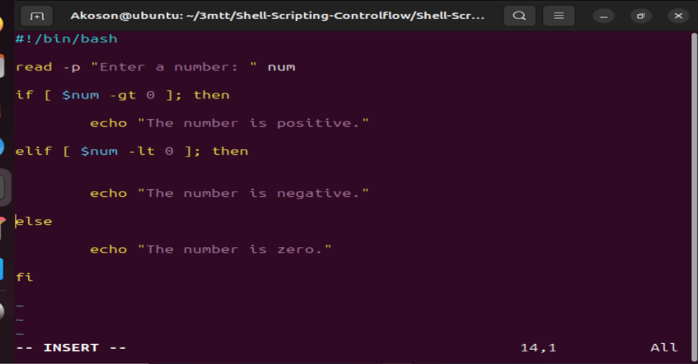

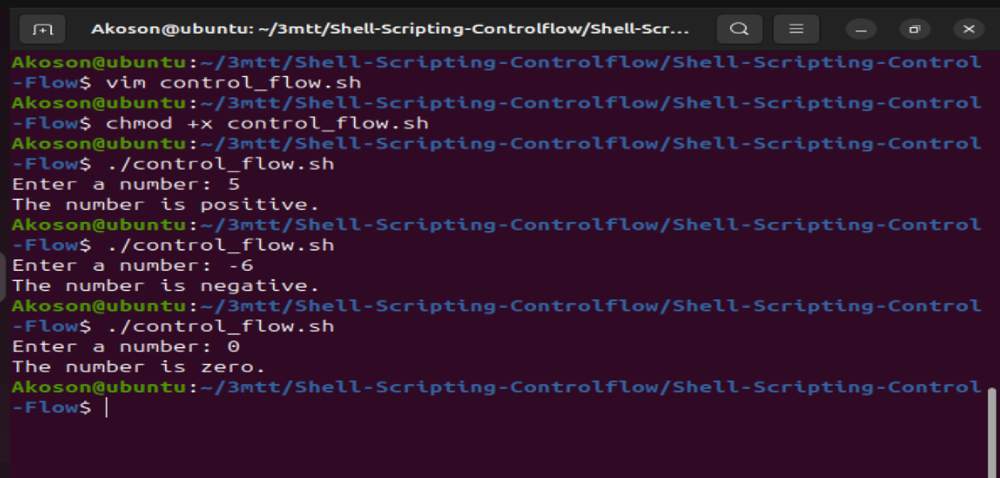

## Breakdown of the script:

### #!/bin/bash

- This is the shebang. It tells the system to use the Bash shell to run the script.

### read -p "Enter a number: " num

- Prompts the user to enter a number.

- The input is stored in the variable num.

- -p displays the message before reading input.

### if [ $num -gt 0 ]; then
### echo "The number is positive."

- Checks if num is greater than 0 using -gt (greater than).

- If true, it prints "The number is positive."

### elif [ $num -lt 0 ]; then
### echo "The number is negative."

- elif stands for "else if".

- Checks if num is less than 0 using -lt (less than).

- If true, it prints "The number is negative."

### else
### echo "The number is zero."
### fi

- If neither of the above conditions is true (i.e., the number is 0), it prints "The number is zero."

- fi ends the if block ("if" spelled backward).

# Summary of the script

## It takes user input (a number)

## Checks whether it is positive, negative, or zero

## Prints the result accordingly

# Updated shell script

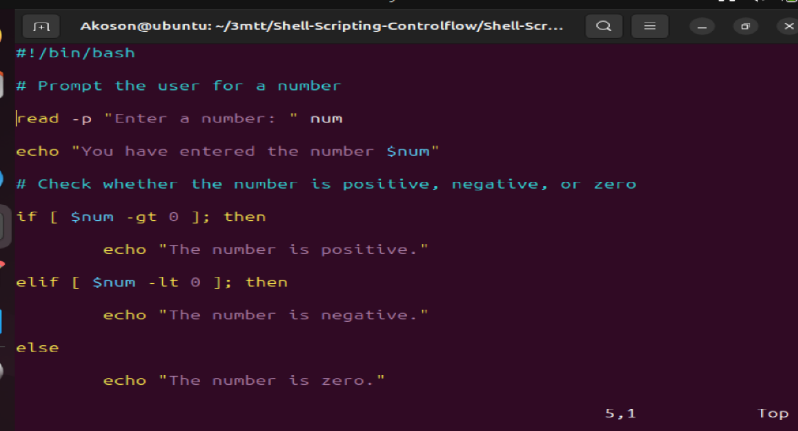

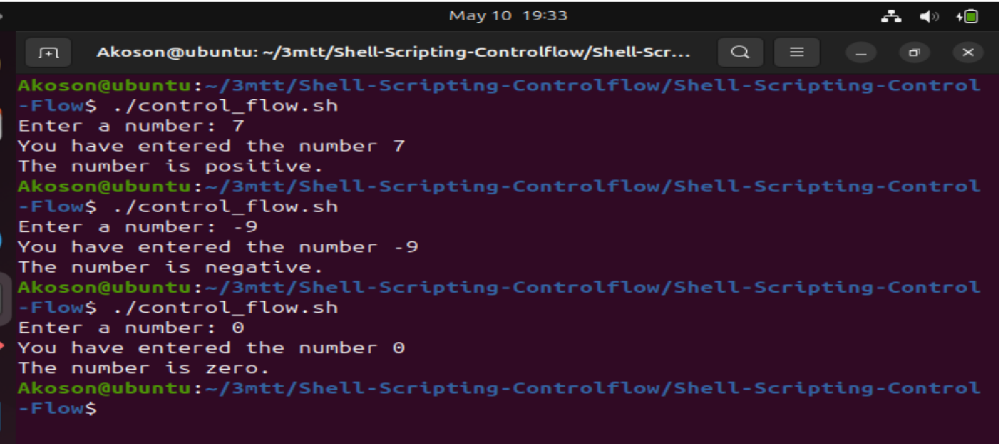

# if statement

## An if statement in bash shell scripting (and other programming languages) is a control structure that lets your script make decisions based on conditions.

## It checks whether a condition is true, and if so, executes a block of code.

# Breakdown

 if [ condition ]; then
    commands
fi

## if: This keyword starts the conditional statement.

## [condition]: The condition to evaluate. Bracket [] are use to enclose the condition being tested.

## then: if the condition is true, execute the command that follows this keyword.

## fi: Ends the if statement. Its basically if spelled backward, indicating the conclusion of the conditional block.

# Lets Practicalize it

### if [ $num -gt 0 ]; then
### echo "The number is positive."

### fi

## The part above test if the value in $num is greater than 0, then most likely you have entered a positive number. Now we update the code.

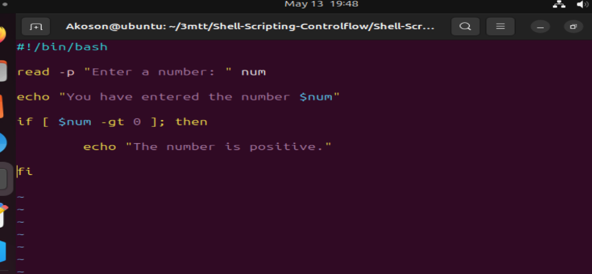

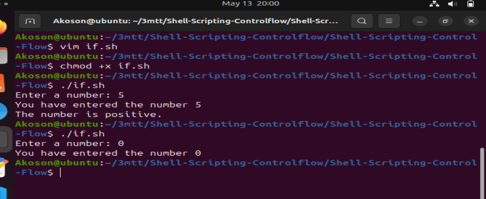

## The keyword -gt in the condition. These are called operators that are used within the condition block to perform numeric comparisons between values.

## Note: Always read your shell script line by line to understand what is doing

# elif statement

## The elif statement (short for "else if") is used in Bash and other shell scripting languages to handle multiple conditions in a structured way.It allows you to test additional conditions when the initial if condition is false, before falling back to else.

- elif is used between if and else. 

- It makes decision-making more flexible.

- You can use multiple elif blocks in one script.

# The basic syntax for using elif is as follow:

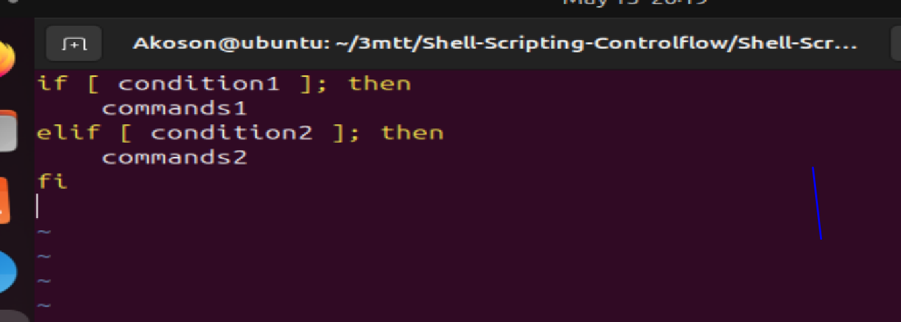

## elif: This keyword is used after an if or another elif block. It allows you to specify an alternative condition to test if the previous conditions were false.

## [condition2]: The new condition you want to evaluate. Like the if statement, this condition is enclose in square bracket[]

## then: if the elif condition is true, execute the command that follows this keyword.

## Now lets apply elif to our script to handle a scenerio where the entered number might ne negative.

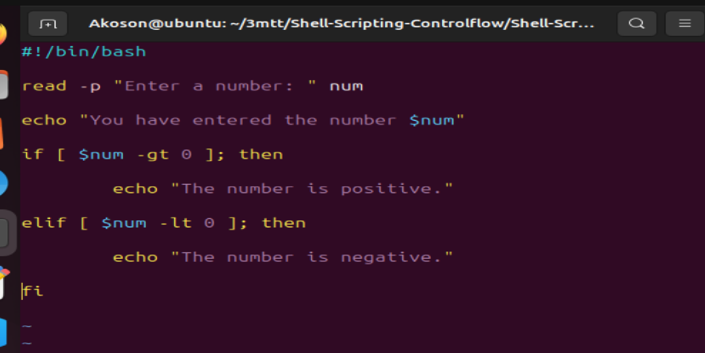

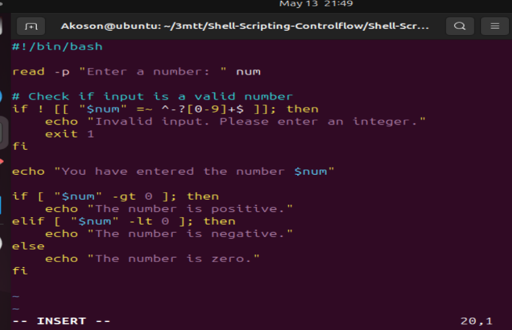

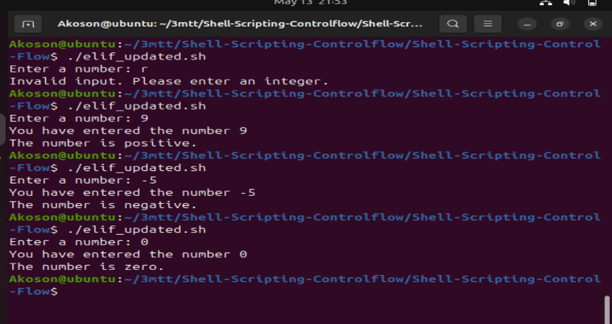

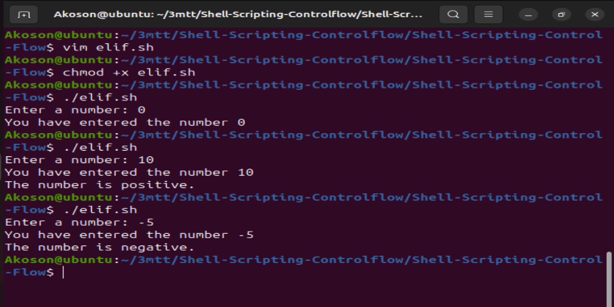

## #!/bin/bash
#### This is the shebang line.It tells the system to run the script using the Bash shell interpreter.

## read -p "Enter a number: " num
### Prompts the user with the message "Enter a number: ".

### Stores the user's input in a variable called num.

## echo "You have entered the number $num"
### Prints back the number the user entered by using the $num variable.Example output: You have entered the number 5

## if [ $num -gt 0 ]; then
### This is the start of an if condition. 

### Checks if the number is greater than 0 (-gt means “greater than”).

### If true, the next line runs.

## echo "The number is positive."

### This line runs only if the condition above is true.

### It outputs: "The number is positive."

## elif [ $num -lt 0 ]; then
### elif stands for "else if".

### This checks if the number is less than 0 (-lt means “less than”).

### If true, the next line runs.

## echo "The number is negative."
### This runs if the elif condition is true.

### It outputs: "The number is negative."

## fi
### Ends the if/elif block.

### It's simply if spelled backward, and it's required in Bash to close the conditional block.

# Loops

## A loop in shell scripting is a control structure that allows you to execute a set of commands repeatedly based on a condition or over a list of items.

## A loop is a way to make your script repeat actions automatically.Instead of writing the same command many times, you tell the computer:

## “Keep doing this job again and again — either a certain number of times or until a condition is met.

# Why Use Loops?

- To save time

- To reduce errors

- To automate repetitive tasks

# Types of Loops in Shell Scripting

## for Loop (Fixed Repetition or List)
### Purpose: Used when you know how many times you want to repeat something — like looping over a list, numbers, or files.

## while Loop (Condition-Based)

### Purpose: Repeats commands as long as a condition is true. You use it when you don’t know in advance how many times it should repeat.

## until Loop (Opposite of while)

### Purpose: Repeats commands until a condition becomes true. So it runs while the condition is false.

## break and continue in Loops

### break: Exits the loop immediately.

### continue: Skips current iteration and moves to the next.

# Illustrating types of loops use cases

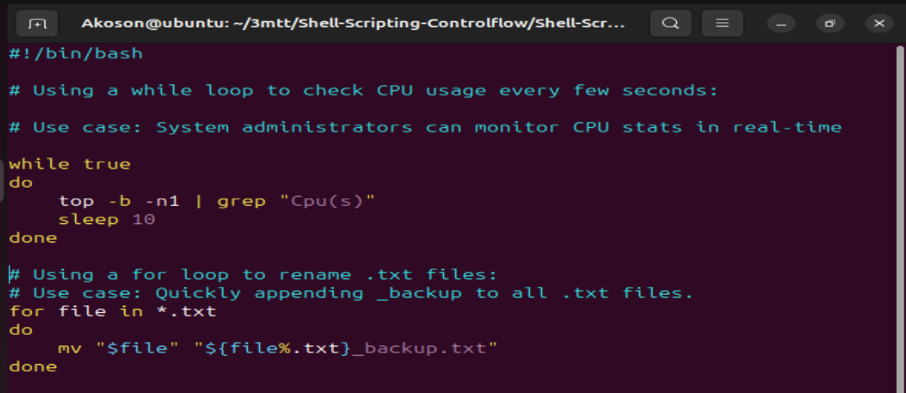

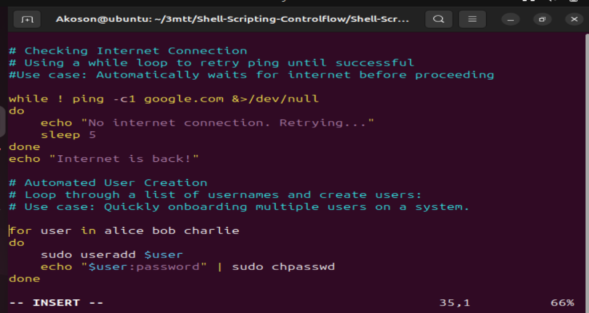

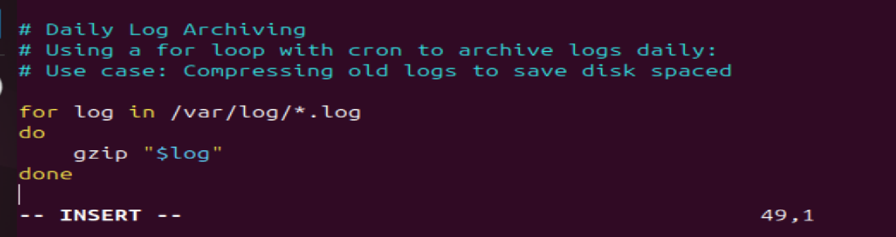

# Some real world scenerio where loops are inevitable

## Batch:

### Suppose you have a folder full of photos you want to resize or edit in some way. Instaead of editing each photo individually, a loop can automate this task, applying the same code to each photo in the folder

## Data Analysis:

### If you are analyzing data, you might nrrd to perform the same calculation on numerous data sets. A loop can iterate through each data set, apply same code to do calculations, and collect the results.

## Automated Testing:

### In software developement, loops are invaluable for running through numerous test codes. You can use a loop to automatically test different inputs for your program and verify that isi behaves as expected using the same code.

# Two types of for loop

## List form: It iterate over a list item

## here is a basic Syntaxes of for loops:

for item in item1 item2 item3; do
    echo $item
done

## for:
### This keyword initiates the loop, signaling the start of a block of code that will repeat.

## item: This is a variable that temperary holds the value of each item in the list as the loop iterates. For each iteration of the loop, item takes on the value of the next item in the list, allowing the commands inside the loop to act on this value. 

## in:

### The in keyword is followed by a list of items that the loop will iterate over. This list can be a series of values, an array, or the output of a command. The loop executes once for each item in the list

## ;

### A semicolon is used here to separate the list of items from the do keyword that follows: If you place the do keyword on the next line, the semocolon is optional

## do:

### This keyword procedes the block of commands that will be executed for each item in the list. The block can contain one or multiple commands, and can perform a wide range of actions, from simple echoe to complex conditional logic.

## done:

### This keyword marks the end of the loop. It signifies that all commands in the loop have been executed for each item in the list, and the loop is complte.

# Illustrating example

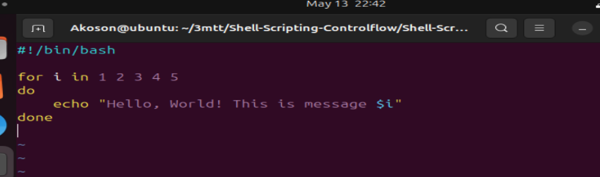

## In this example 

### The loops starts with for i in 12345, meaning the variable i will take each value in the list (1,2,3,4,5) in turn.

### For each value of i, the loop executes the commands between do and done.

### The command echo "Hello world! This is message $i" prints a greeting along with the current value of i. Once i has taken each value in the list, the loop ends.

# Task

- Create a shell script for each type of the for loop

- insert the code in the file

- Set the correct permission for the scripts

- Execute the script and evaluate your experienced

## For loop over a list:

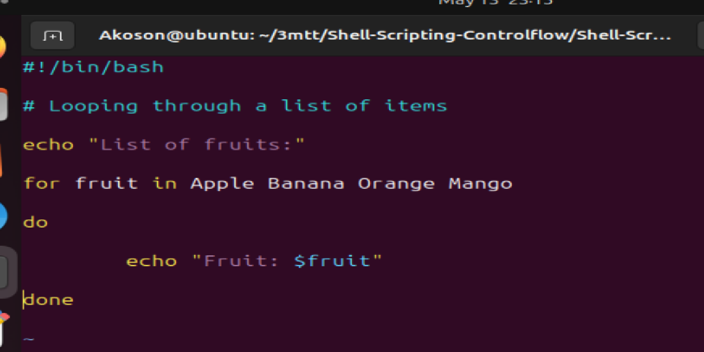

## for loop with range

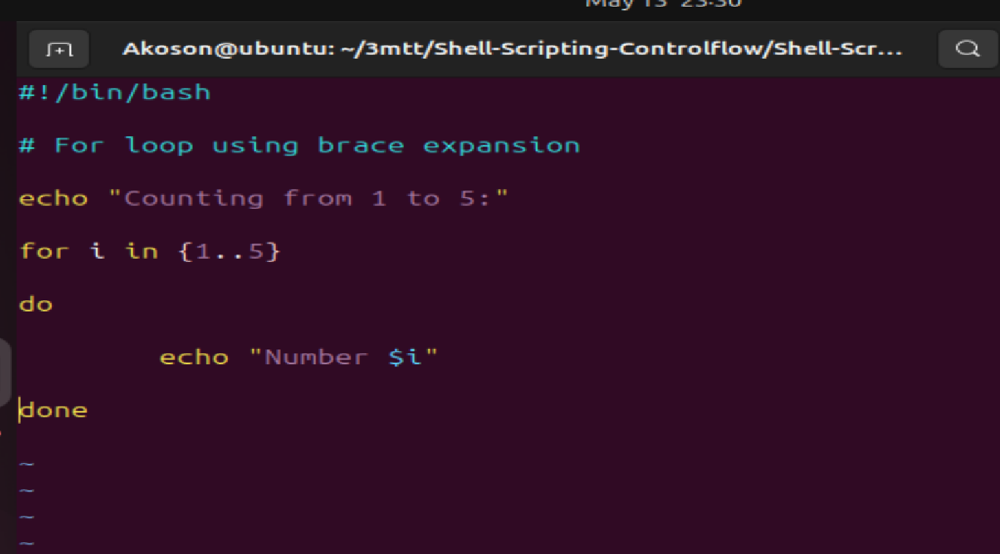

## for loop with c-style

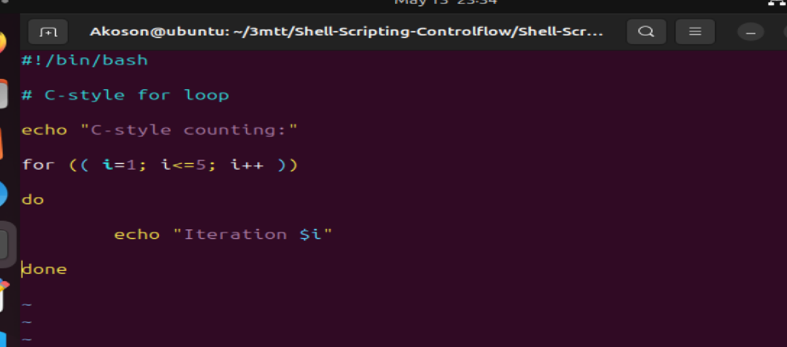

# Executing the scrpt

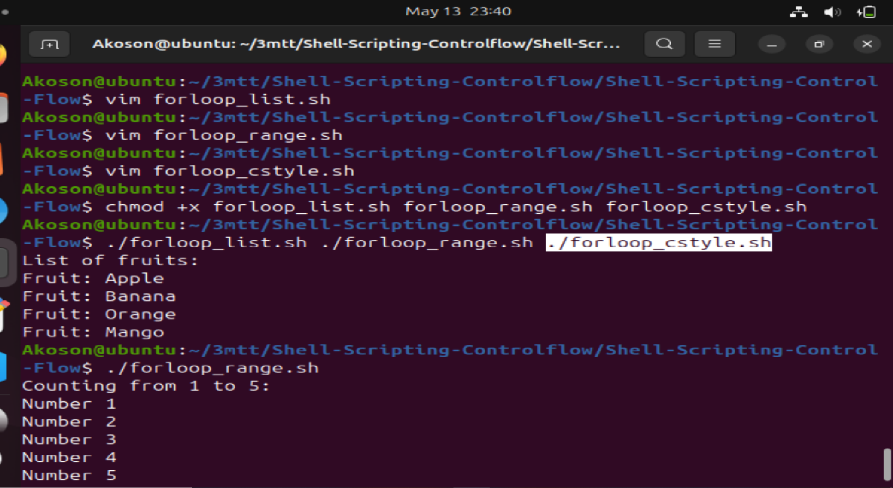

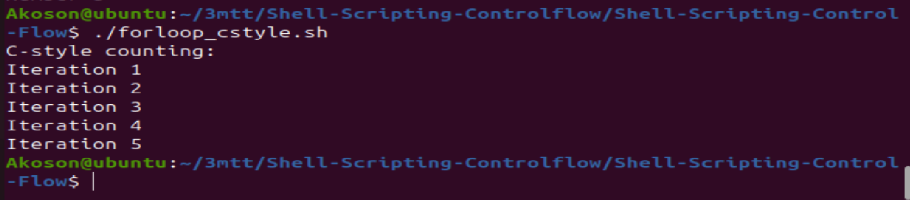

## C-Style form:

### This style allows you to specify an initializer, condition and increment or decrenent expression. It is base on the same sybtax used in doing a for loop in Cprogramming like this: 

for (( i=0; i<5; i++ )); do
    echo "Number $i"
done

## Breaking down the syntaxes

- "for (( ... ));": This is the syntax that starts a C-style for loop in Bash. It's distinguished from the list form by the double parentheses "(( ... ))", which enclose the three parts of the loop: "initialization, condition, and increment/decrement".

- "i=0": This is the initialization part. Before the loop starts, "i" is set to "0". This typically sets up a counter variable to start from a certain value. In this case, i starts from 0.

- "i<5": This is the condition for the loop to continue running. After each iteration of the loop, Bash checks this condition. If it's true, the loop continues; if it's false, the loop ends. Here, the loop will continue as long as **i** is less than "5".

- "i++": This is the increment expression. It's executed at the end of each loop iteration. i++ is shorthand for incrementing i by 1 (i = i + 1). This step ensures that the loop will eventually end by changing the value of i so that the condition i<5 will not always be true.

- "do ... done": Encloses the commands to be executed in each iteration of the loop. Here, the command inside the loop is **echo "Number $i"**, which prints the current value of "i" to the console.

## How it works:

- Initialization: Before the first iteration, "i" is set to "0".
- Condition Check: Before each iteration, including the first, Bash checks if i is less than 5.
-If the condition is true, Bash executes the commands inside the loop.
-If the condition is false, Bash exits the loop.

- Execute Commands: The command(s) inside the "do ... done" block are executed. In this case, it prints the current value of "i".
- "Increment:" After executing the commands, "i" is incremented by "1" using the syntax "(i++)".
- **Repeat:** Steps 2 through 4 are repeated until the condition in step 2 is false.

## Lets take a Walkthrough to further expand on your understanding**

- "First Iteration:" i=0, condition 0<5 is true, prints "Number 0", increments i to 1.
- "Second Iteration:" i=1, condition 1<5 is true, prints "Number 1", increments i to 2.
- "Continues iteration" ...
- "Fifth Iteration:" i=4, condition 4<5 is true, prints "Number 4", increments i to 5.
- "Sixth Check:" i=5, condition 5<5 is false, loop ends.

## This C-style for loop is powerful for numerical iterations, especially when you need precise control over the start, end, and step size of the loop.

